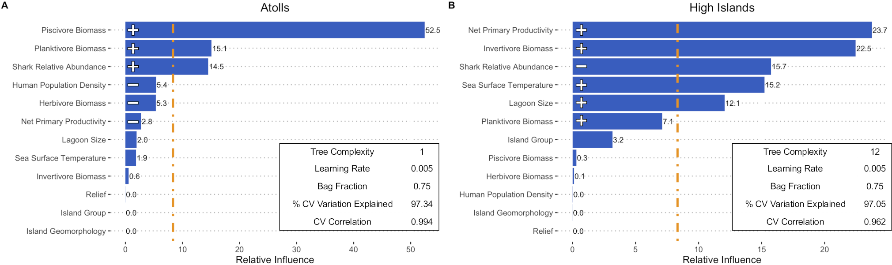
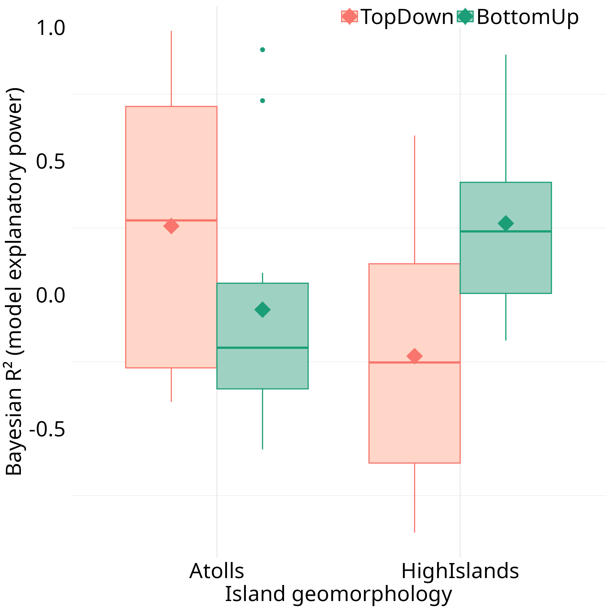
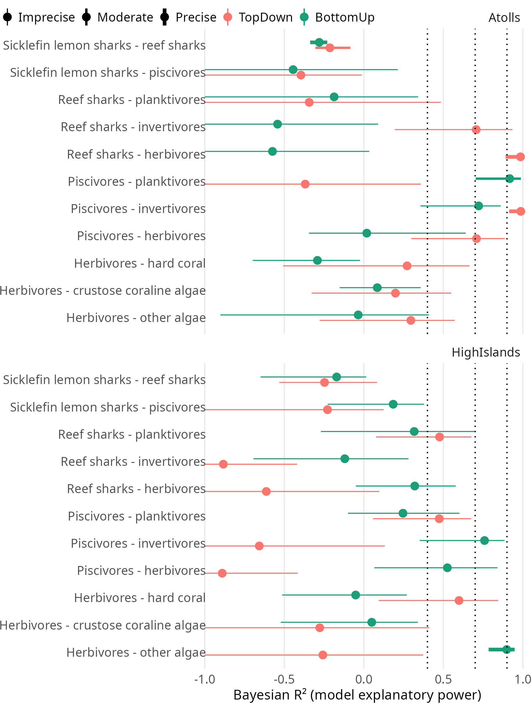
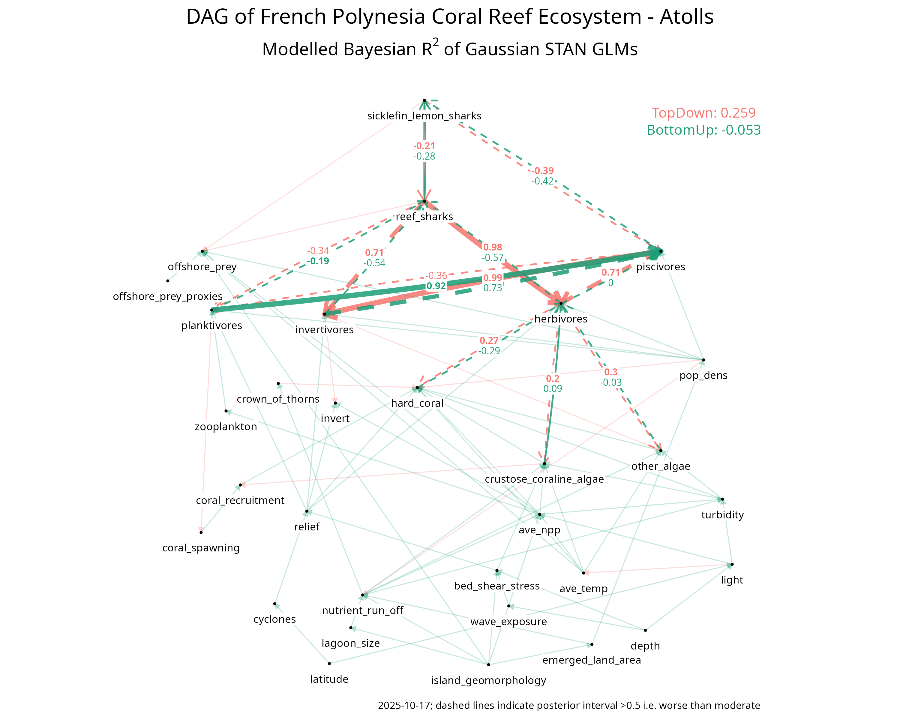
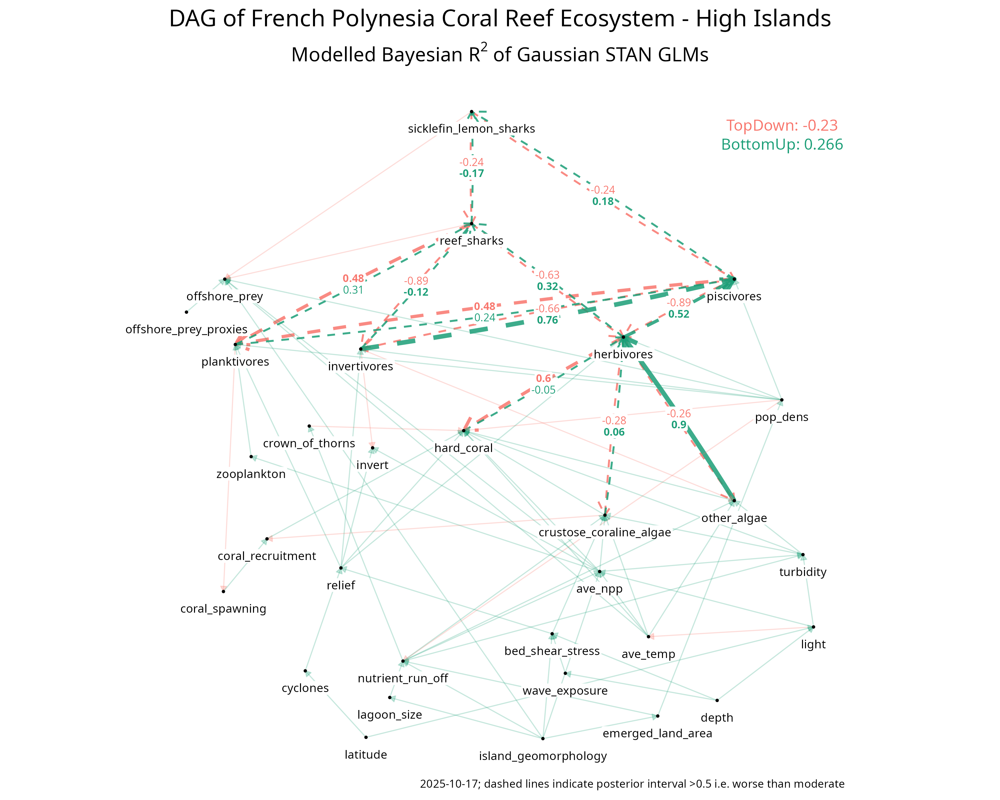
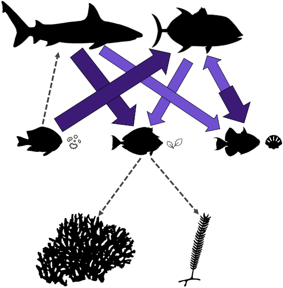
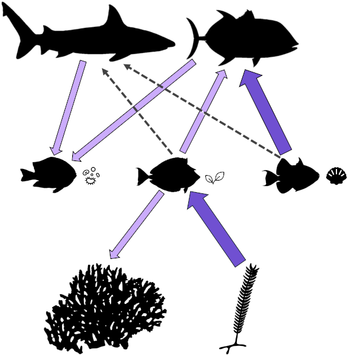
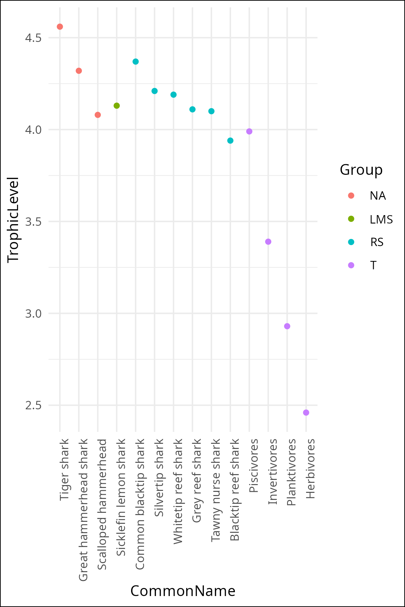

# Top-down and bottom-up forcing on French Polynesian coral reefs

[](LICENSE)
[](#data-availability)
[](#data-availability)

Analysis code for the manuscript:

> **Dedman, S., Farabaugh, N. F., Bond, M. E., Chapman, D., Clua, E., Harborne, A. R., Papastamatiou, Y. P., Kiszka, J. J., Heupel, M., Wirsing, A. J., & Heithaus, M. R. (2026). Top-down and bottom-up forcing on coral reefs changes with habitat-specific predator abundance.** *Proceedings of the National Academy of Sciences* or *Science*, in preparation. DOI: TBD.

Corresponding author: Simon Dedman (simondedman@gmail.com). Co-first authors: Simon Dedman and Naomi F. Farabaugh.

---

## Overview

We test whether top-down forcing (sharks → mesopredators → herbivores → benthos) or bottom-up forcing (productivity → herbivores → benthos) better explains coral-reef community structure across 24 reefs in French Polynesia, and whether the dominant direction differs between atolls (where sharks are abundant) and high islands (where sharks are sparse).

Three statistical approaches are layered:

1. **Boosted Regression Trees (BRT)** to identify which predictor variables most influence fish biomass and benthic cover, separately for atolls and high islands.
2. **Directed Acyclic Graphs (DAGs)** to encode the hypothesised causal structure, validated by d-separation tests against the data.
3. **Bayesian Structural Causal Models** (`brms`) with Student-t errors and cubic shrinkage splines to estimate the strength of each top-down and bottom-up pathway, compared via leave-one-out cross-validation (LOO-PSIS).

Surveys combine baited remote underwater video (BRUV) for sharks, underwater visual census (UVC) for reef fish biomass, and benthic UVC for coral, algal, and substrate cover.

---

## Repository structure

```
.
├── R/                      Analysis scripts (numbered execution order)
│   ├── 00_*.R … 08_*.R     Active pipeline (see "Pipeline" below)
│   ├── archive/            Superseded / exploratory scripts kept for transparency
│   └── utils/              Helper scripts (e.g. strip_brm_dso.R)
├── data/
│   └── README.md           Manifest for the FIU Dataverse archive
├── figures/
│   ├── main/               Main paper figures (committed for README rendering)
│   └── supplementary/      Selected SM figure thumbnails
├── CITATION.cff            Citation metadata (renders on GitHub)
├── LICENSE                 GPL v3
└── FIU-SharkFishCoral-FrenchPoly.Rproj
```

Local-only directories (gitignored) referenced by the scripts: `NFF_data/` for raw and processed data (downloaded from the FIU Dataverse, see `data/README.md`), `Results/` for BRT and DAG model outputs, `Docs/` for the manuscript and supplementary material, and `Nat_resources/` and `Presentations/` for working materials.

---

## Reproduction

Three reproducibility tiers, depending on how much you want to recompute.

### Tier 0 - full pipeline from raw data (~few hours)

```bash
git clone https://github.com/SimonDedman/FIU-SharkFishCoral-FrenchPoly.git
cd FIU-SharkFishCoral-FrenchPoly
```

1. Download the data archive from FIU Dataverse (DOI: TBD) into `NFF_data/` at the project root.
2. Open the project in RStudio (`FIU-SharkFishCoral-FrenchPoly.Rproj`).
3. `renv::restore()` to install pinned package versions.
4. Run scripts in `R/` in numeric order, or use `targets::tar_make()` once the `_targets.R` pipeline is in place (planned for v1.0).

### Tier 1 - skip Bayesian fit (a few minutes)

The full Bayesian fit takes a substantial amount of time (44 brm fits across 4 atoll/island × top-down/bottom-up scenarios, with `add_criterion(loo, reloo = TRUE)` triggering refits where Pareto-k diagnostics are poor). To bypass it:

1. Steps 1-3 above.
2. Additionally download `models_list_*_spline.Rds` and `posteriors_list_spline.Rds` from the Dataverse archive into `Results/DAG/`.
3. Run only the post-fitting scripts (results processing, LOO comparison, plotting).

The compiled Stan binaries have been stripped from the model objects (`R/utils/strip_brm_dso.R`), reducing each `models_list_*_spline.Rds` from ~210 MB to ~17-20 MB. `summary()`, `plot()`, `posterior_predict()`, and `loo()` work directly; `update()` will trigger a one-time recompile.

### Tier 2 - inspect summaries only (no recomputation)

Download the small CSV / Rds summaries from `Results/DAG/` on Dataverse:

- `bayesR2_spline.csv` - Bayesian R² values per model
- `95pct_intervals_list_*_spline.csv` - posterior intervals
- `loo_compare_results_spline.csv` - LOO-PSIS model comparison
- `*plot_spline.Rds` - saved ggplot objects (TD/BU × atolls/HI DAG networks)

These files are <1 MB each.

---

## Pipeline

| Step | Script | Inputs | Outputs |
|---|---|---|---|
| 1. Data preparation | `01_data_prep.R` | Raw benthic UVC, fish UVC, BRUV CSVs | `ch4_reef_wide_df2.RData` (24-reef analysis table) and atoll/island subsets |
| 2. Trophic level lookup | `02_trophic_levels.R` | FishBase API; functional group definitions | Mean trophic levels per group (used in SM Fig 32) |
| 3. BRT models | `03_BRT_models.R` | `ch4_*_reef_wide_df2.RData` | BRT diagnostics, partial dependence plots → `Results/BRT/` |
| 4. DAG consistency | `04_DAG_consistency.R` (collapsed from 4 legacy scripts) | `ReefWideBRUVUVC.csv` + 5 candidate DAGs | per-DAG `dag_inconsistencies_<dag>_*.csv` files in `Results/DAG/consistency/` |
| 5. Bayesian SCM fits | `05_DAG_bayesian_fits.R` | DAG-tested data | 4 × `models_list_*_spline.Rds` (Atolls/HI × TD/BU) |
| 6. Results processing & comparison | `06_DAG_results.R` | model lists | LOO summaries, posterior intervals, R², stacking weights |
| 7. DAG network plots | `07_DAG_network_plots.R` | model lists, posterior summaries | DAG figures (Main Fig 4, SM Fig 14) |
| 8. Raw data summaries (SM) | `08_supplementary_plots.R` | reef-wide table | Boxplots, column plots, scatterplots |

Numbering will be tightened to a clean 01-08 in v1.0; see `R/archive/` for superseded variants.

---

## Figures

### Main paper figures

<table>
  <tr>
    <td align="center" width="50%">
      <a href="figures/main/fig1_BRT_relative_influence.png"></a><br>
      <b>Fig 1.</b> BRT relative influence of predictors on each response, separately for atolls and high islands.<br>
      <em>Source: <code>R/03_BRT_models.R</code></em>
    </td>
    <td align="center" width="50%">
      <a href="figures/main/fig2_BayesR2_boxplots.png"></a><br>
      <b>Fig 2.</b> Bayesian R² distributions per model, faceted by topology x trophic direction.<br>
      <em>Source: <code>R/06_DAG_results.R</code></em>
    </td>
  </tr>
  <tr>
    <td align="center">
      <a href="figures/main/fig3_BayesR2_TDvsBU_byTopo.png"></a><br>
      <b>Fig 3.</b> Mean Bayesian R² for top-down vs bottom-up models, faceted by topology.<br>
      <em>Source: <code>R/06_DAG_results.R</code></em>
    </td>
    <td align="center">
      <a href="figures/main/fig4a_DAG_Atolls.png"></a>
      <a href="figures/main/fig4b_DAG_HighIslands.png"></a><br>
      <b>Fig 4.</b> DAG networks with posterior-weighted edge strengths, atolls (left) and high islands (right).<br>
      <em>Source: <code>R/07_DAG_network_plots.R</code></em>
    </td>
  </tr>
</table>

### Supplementary figure highlights

<table>
  <tr>
    <td align="center" width="33%">
      <a href="figures/supplementary/SM_foodweb_atoll.png"></a><br>
      <b>Atoll foodweb.</b> Hypothesised top-down trophic structure for atoll reefs (sharks abundant). Hand-edited from a dagitty.net export by N. F. Farabaugh; not generated from R code.
    </td>
    <td align="center" width="33%">
      <a href="figures/supplementary/SM_foodweb_HighIslands.png"></a><br>
      <b>High-islands foodweb.</b> Bottom-up alternative for high-island reefs (sharks sparse). Same provenance as above.
    </td>
    <td align="center" width="33%">
      <a href="figures/supplementary/SM_Fig32_FnGp_trophic_levels.png"></a><br>
      <b>SM Fig 32.</b> Functional group trophic levels (FishBase-derived).<br>
      <em>Source: <code>R/02_trophic_levels.R</code> (computation), <code>R/01_data_prep.R</code> (rendering)</em>
    </td>
  </tr>
</table>

The full inventory of supplementary figures (15 listed in MEMORY.md plus additional renumberings, with SM Fig 32 covering the trophic-level lookup) is documented in the manuscript SM. PNGs and PDFs of every SM figure ship in the Dataverse archive under `Results/`; only highlights are reproduced here for quick orientation.

---

## Data availability

All raw and processed data are deposited on the **FIU Dataverse**:

> Dedman, S., et al. (2026). Data for: Top-down and bottom-up forcing on coral reefs changes with habitat-specific predator abundance. FIU Dataverse. DOI: TBD.

See `data/README.md` for the file-level manifest.

This GitHub repository contains code only. Tagged releases are mirrored to **Zenodo** for a citable code DOI:

> Dedman, S., et al. (2026). FIU-SharkFishCoral-FrenchPoly: code archive. Zenodo. DOI: TBD.

---

## Authors

| Author | Affiliation | ORCID |
|---|---|---|
| Simon Dedman (corresponding author, co-first author) | Florida International University | [0000-0002-9108-972X](https://orcid.org/0000-0002-9108-972X) |
| Naomi F. Farabaugh (co-first author) | Florida International University; University of Washington | [0000-0002-7839-7453](https://orcid.org/0000-0002-7839-7453) |
| Mark E. Bond | Florida International University | [0000-0001-5261-5152](https://orcid.org/0000-0001-5261-5152) |
| Demian Chapman | Florida International University | [0000-0002-7976-0947](https://orcid.org/0000-0002-7976-0947) |
| Eric Clua | PSL Research University, CRIOBE, Moorea | [0000-0001-7629-2685](https://orcid.org/0000-0001-7629-2685) |
| Alastair R. Harborne | Florida International University | [0000-0002-6818-8615](https://orcid.org/0000-0002-6818-8615) |
| Yannis P. Papastamatiou | Florida International University | [0000-0002-6091-6841](https://orcid.org/0000-0002-6091-6841) |
| Jeremy J. Kiszka | Florida International University | [0000-0003-1095-8979](https://orcid.org/0000-0003-1095-8979) |
| Michelle Heupel | Australian Institute of Marine Science | [0000-0002-8245-7332](https://orcid.org/0000-0002-8245-7332) |
| Aaron J. Wirsing | University of Washington | [0000-0001-8326-5394](https://orcid.org/0000-0001-8326-5394) |
| Michael R. Heithaus | Florida International University | [0000-0002-3219-1003](https://orcid.org/0000-0002-3219-1003) |

---

## Acknowledgements

DAG framework and consistency-test methodology developed in collaboration with Suchinta Arif ([0000-0001-8381-3071](https://orcid.org/0000-0001-8381-3071)). Field data were collected during the Global FinPrint French Polynesia campaign; we thank the field team and partner organisations.

(Acknowledgements section is provisional and will be expanded to match the manuscript's final acknowledgements.)

---

## License

This repository is licensed under the GNU General Public License v3.0 (see [LICENSE](LICENSE)). The data archive on Dataverse may carry separate licensing terms; see its landing page.

---

## Issues and contact

Bugs and reproducibility problems: please open an issue at https://github.com/SimonDedman/FIU-SharkFishCoral-FrenchPoly/issues.

Questions about the science: simondedman@gmail.com.
